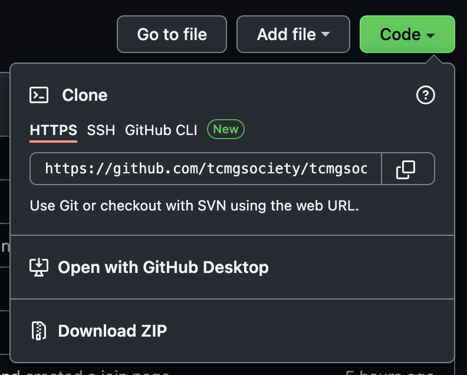
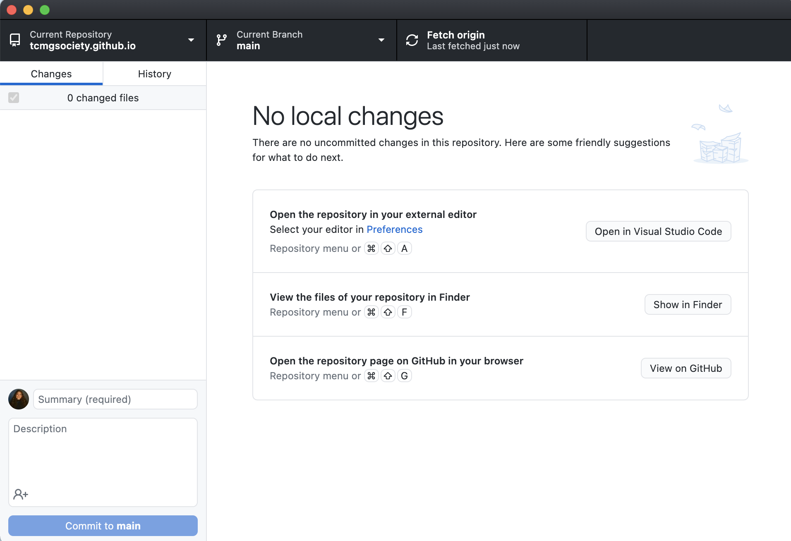

# tcmgsociety.github.io

## Who we are

The purpose of the Technology Management Society is to assist students in the technology management major connect with the faculty and staff. TMS will help students get information about the state of the major and any future changes. It will also provide the faculty with a way to effectively gather feedback. from the students. TMS will also host events with technology management alumni and people in the industry. It will also help foster a stronger community in the major.

## Our Mission

To assist students develop, promote, and motivate success for students in the intersecting space of business with technology, and to connect them with the faculty, staff, and Bryan-College Station community.

## Our Vision

Our vision is to produce impactful and successful technology management leaders in our community, academic and professional space.

## How to access website repository on your own device

### Repository Access

**EDITS** Due to changing our profile from personal to organizaiton, please message either Jacob or Paula to add you as a collaborator to our organization, which gives you access to our platform. You should not need to make yourself a collaborator to our repo [HERE](https://github.com/tcmgsociety/tcmgsociety.github.io).

If you have collaborator access to the repository, feel free to skip this section. If you have not, here are the steps.

```text
> Go to its respective repo, for example: https://github.com/tcmgsociety/tcmgsociety.github.io
> Go to the settings tab
> On the settings tab's sidebar
> click Collaborators
> click 'Add People' 
> Input your username
> Check your email associate to your github account to join.
```

### Install GitHub Desktop and Visual Studio Code

How to install GitHub Deskop [HERE](https://docs.github.com/en/desktop/installing-and-configuring-github-desktop/installing-and-authenticating-to-github-desktop/installing-github-desktop)

How to install Visual Studio Code [HERE](https://docs.microsoft.com/en-us/visualstudio/install/install-visual-studio?view=vs-2022)

### Extensions to Install on VS Code

How to install extensions [HERE](https://code.visualstudio.com/docs/editor/extension-marketplace)

1. Prettier
2. Color Info
3. TODO Highlight
4. Live server

### Opening on GitHub Desktop

Go over to our repository page on GitHub [HERE](https://github.com/tcmgsociety/tcmgsociety.github.io)

Click Open with GitHub Desktop, then follow the steps prompted on your window.

You should now see this:


### Opening a file

Once you see this

Click ```Open in Visual Studio Code``` to be able to view and edit the repository's files.

### Running the file

To be able to view the HTML file on a web browser, right click on the opened page on the VSCode window and click 'Open with Live Server' (should be at the very bottom).

And there you go! Reach out to me through Discord (arcticsck) or email (caden.kokes@tamu.edu) if you have any questions! :)
